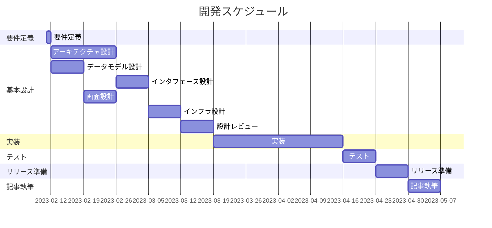

# Web App Development with AI

このリポジトリでは、2023 年現在一般に利用可能な AI 技術を活用し、Web アプリケーションの開発を試みる。

## 開発スケジュール



## 基本方針

- 基本的な TODO アプリの構築を目指す
- 以下を開発のスコープとする
  - 要件定義
  - 基本設計
  - 詳細設計
  - 実装
  - テスト
  - リリース
  - 運用
- AI は開発のパートナーという位置付けで考え、無理に AI のみで作成するということにこだわりすぎない
- なるべく AI の提案を採用する方針とするが、開発にかかるコストや工数を考慮し、ある程度の方向づけは行う

## リポジトリの構造

```
.
├── README.md # このファイル
├── dialogs   # 対話型AI(chatGPT)との会話ログ
└── docs      # AIとの会話をまとめた資料
```

## 利用ツール

- chatGPT
- aicommits
