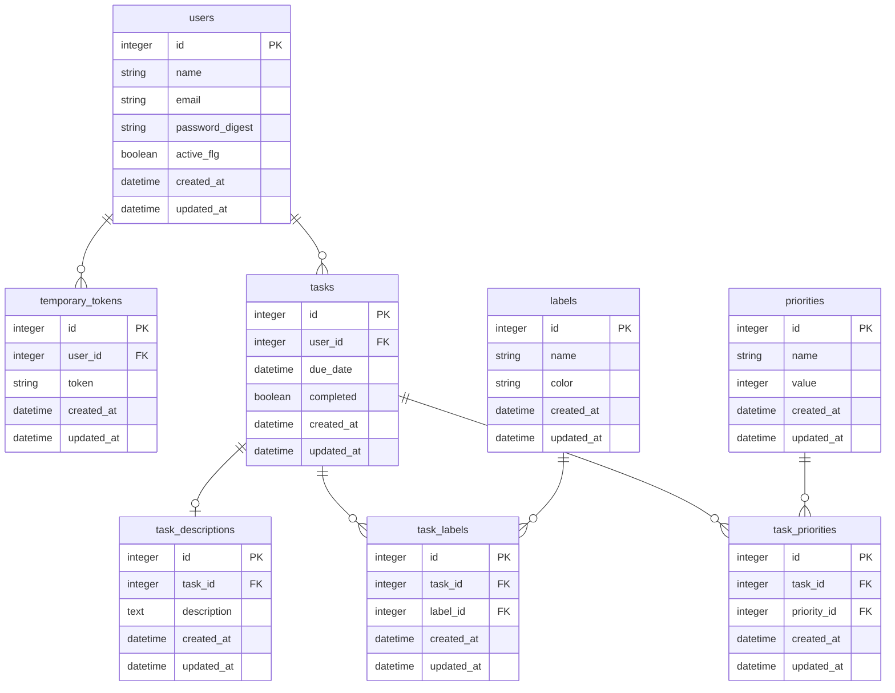

# 基本設計

## アーキテクチャ設計

- クライアントサイド: Nuxt.js
- サーバーサイド: Ruby on Rails

## データモデル設計

```mermaid
erDiagram

users {
    integer id PK
    string name
    string email
    string password_digest
    boolean active_flg
    datetime created_at
    datetime updated_at
}

temporary_tokens {
    integer id PK
    integer user_id FK
    string token
    datetime created_at
    datetime updated_at
}

tasks {
    integer id PK
    integer user_id FK
    datetime due_date
    boolean completed
    datetime created_at
    datetime updated_at
}

task_descriptions {
    integer id PK
    integer task_id FK
    text description
    datetime created_at
    datetime updated_at
}

labels {
    integer id PK
    string name
    string color
    datetime created_at
    datetime updated_at
}

task_labels {
    integer id PK
    integer task_id FK
    integer label_id FK
    datetime created_at
    datetime updated_at
}

priorities {
    integer id PK
    string name
    integer value
    datetime created_at
    datetime updated_at
}

task_priorities {
    integer id PK
    integer task_id FK
    integer priority_id FK
    datetime created_at
    datetime updated_at
}

users ||--o{ tasks: ""
users ||--o{ temporary_tokens: ""
tasks ||--o| task_descriptions: ""
tasks ||--o{ task_labels: ""
labels ||--o{ task_labels: ""
tasks ||--o{ task_priorities: ""
priorities ||--o{ task_priorities: ""
```

## API インターフェース設計

- ユーザー登録用エンドポイント
- 認証用エンドポイント
- タスク管理エンドポイント
- タスク詳細エンドポイント
- ラベル管理エンドポイント
- 優先度管理エンドポイント
